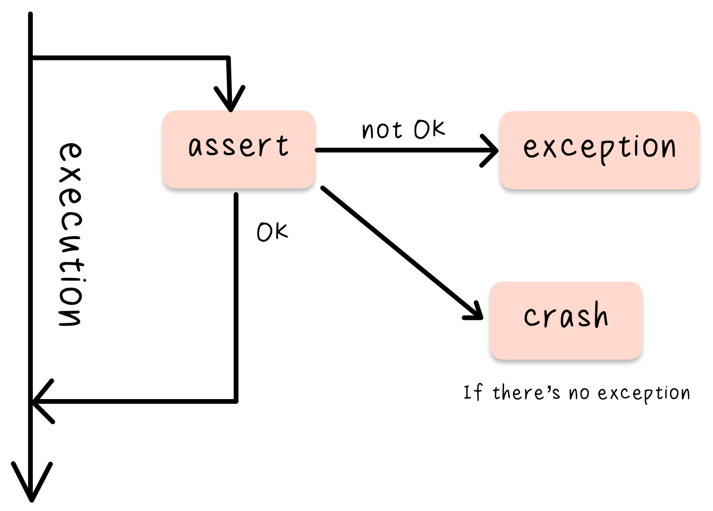
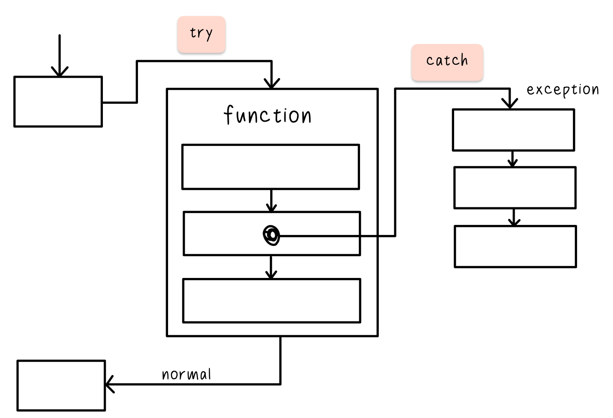

# Topic 3 Defensive coding, debugging and exception handling

## Week 9 Assertion and parameter checking

### Learning objectives

- Define what an assertion is in a computer program
- Explain the difference between assertions and logical control flow
- Write assertion code and reason about how and when to enable and disable it

### Readings

**Opinion 1: Always use assertions**

- ([PDF](../08-PDF/Assertive%20Testing%20%5BReliable%20Code%5D.pdf)) Holzmann, G.J. ['Assertive testing [reliable code]'](https://ieeexplore.ieee.org/document/7093042), IEEE Software 32(3) 2015, pp.12–15.

**Opinion 2: In industry, assertions are often removed in release builds**

- ([PDF](../08-PDF/A%20Historical%20Perspective%20on%20Runtime%20Assertion%20Checking%20in%20Software%20Development%20.pdf)) Clarke, L.A. and D.S. Rosenblum ['A historical perspective on runtime assertion checking in software development'](https://discovery.ucl.ac.uk/id/eprint/4991/), SIGSOFT Software Engineering Notes 31(3) 2006, pp.25–37.

**For a great discussion of various aspects**: [What are assertions? ](https://web.archive.org/web/20191209110926/http://wiki.c2.com/?WhatAreAssertions)

- ([PDF](../08-PDF/Assertions%20-%20a%20personal%20perspective.pdf)) Classic paper: Hoare, C.A.R ['Assertions: a personal perspective'](https://ieeexplore.ieee.org/document/1203056), IEEE Annals of the History of Computing 25(2) 2003, pp.14–25.
- ([PDF](../08-PDF/Design%20by%20contract%20-%20the%20lessons%20of%20Ariane.pdf)) Ariane Rocket explosion: Jazequel, J.-M. and B. Meyer, ['Design by contract: the lessons of Ariane'](https://ieeexplore.ieee.org/document/562936), Computer 30(1) 1997, pp.129–30.

### Assertions

Assume in runtime assertion where the program is running. Other types of assertions: unit tests, compile-time assertions.

> An assertion is a check in your code that evaluates a boolean expression. It checks whether the program is in a desirable state.

```
int gameScore;
...
assert(gameScore >= 0);
```

An `if` statement controls the flow of the program;
An `assertion` checks the state.

**What should you do if a run-time assertion fails?**

- Terminate the program

  <span style="color: gray">We might not want to terminate the whole program if it's something multiple users are using at once.</span>

- Print an error

  <span style="color: gray">If writing a library, we can't predict what it's been used for hence the error message might not make sense.</span>

- Throw an exception

  A pretty good way to deal with assertion failure.
  <span style="color: gray">The part of the program calling the code might not be able to handle it.</span>

- Carry on regardless

### Assertions & SDD lifecycle

> **_Test that the loop has not iterated more than 10,000 times._**

> **_Before devision operation, check you are not dividing by zero._**

#### lifecycle <span style="color: gray">(Simplified version)</span>

- **Release build**: remove all/dmost assertions from debug build to save runtime (opinionated)

- **Debug build**

### Demonstration of Assertions

- [Assertion in C++](assert.cpp)

  ```
  #include <cassert>

  int main() {
      double sensorReading = 65537;
      unsigned short storedValue = sensorReading;
      assert(storedValue == sensorReading);
      return 0;
  }
  ```

- [Assertion in Python](assert.ipynb)

  ```
  sensorReading = 65000
  storedValue = sensorReading+1
  assert(storedValue == sensorReading)
  ```

- [Assertion in JavaScript](assert.js)

  ```
  const assert = require("assert");

  let sensorReading = 65500;
  let storedValue = sensorReading+1;
  assert(storedValue == sensorReading);
  ```

---

## Week 10 Secure programming

### Learning Objectives

- Explain the wider context of secure programing
- Describe and use basic secure programming techniques
- Give real-world industry examples of secure programming workflows

### Reading

([PDF](../08-PDF/The%20protection%20of%20information%20in%20computer%20systems.pdf)) Classic paper from 1975: Saltzer, J.H. and M. D. Schroeder '[The protection of information in computer systems](https://ieeexplore.ieee.org/document/1451869)', Proceedings of the IEEE 63(9) 1975, pp.1278–308.

([PDF](../08-PDF/Secure%20Programs%20HOWTO.pdf)) David Wheeler's book is a great resource. It is Unix focused but applicable to all platforms: Wheeler, D.A. [Secure programming for Linux and Unix HOWTO](https://dwheeler.com/secure-programs/) (1999).

Some interesting articles can be found in [Security and Privacy](https://ieeexplore.ieee.org/xpl/RecentIssue.jsp?punumber=8013).

([PDF](../08-PDF/Are%20Companies%20Actually%20Using%20Secure%20Development%20Life%20Cycles.pdf)) For an analysis of software companies' approach to secure software, read Geer, D. '[Are companies actually using secure development life cycles?](https://ieeexplore.ieee.org/document/5481927)', Computer 43(6) 2010, pp.12–16.

Links:

- [Microsoft SDL practices](https://www.microsoft.com/en-us/securityengineering/sdl/practices)

- ([PDF](../08-PDF/SAMM-1.0.pdf)) [Software Assurance Maturity Model](https://web.archive.org/web/20200818024731/https://www.opensamm.org/)

- [Building Security in Maturity Model](https://web.archive.org/web/20200831112350/https://www.bsimm.com/)

- Comprehensive, Lightweight Application Security Process (CLASP)/Open Source Foundation for Application Security (OWASP): [Introduction to the CLASP process](https://web.archive.org/web/20200911124016/https://us-cert.cisa.gov/bsi/articles/best-practices/requirements-engineering/introduction-to-the-clasp-process)

- OWASP: [Top 10 issues for web application security](https://github.com/OWASP/www-project-top-ten/blob/master/index.md)

### Secure programming overview

**Security goals**

- Confidentiality: Who can see? «Read access»
- Integrity: Who can modify and how? «Write access»
- Availability: Can they access it?

**Sucure Programming Hit List**

- Validate All Input

  <span style="color: gray">Ex. Keyboard presses, files read from disk, data passed to a function, data received over a network. </span>

- Restrict Operations to Buffer Bounds

  <span style="color: gray">Ex. [Heartbleed](https://en.wikipedia.org/wiki/Heartbleed) causes buffer bounds (overflow), [Wannacry](https://en.wikipedia.org/wiki/WannaCry_ransomware_attack) from North Korea, [The internet worm](https://en.wikipedia.org/wiki/Morris_worm) had a buffer overflow attack component.</span>

- Follow Good Security Design Principles

  From [The protection of information in computer systems](../08-PDF/The%20protection%20of%20information%20in%20computer%20systems.pdf)

  <span style="color: gray">
    <ul>
      <li>Least privilege</li>
      <li>Economy of mechanism/simplicity</li>
      <li>Open design</li>
      <li>Complete mediation: check every access</li>
      <li>Failsafe defaults</li>
      <li>Separation of privilege</li>
      <li>Least common mechanism</li>
      <li>Psychological acceptability/Easy to use</li>
    </ul>

- Carefully call out to other resources

  <span style="color: gray">Ex. Library routines, databases, external programs. </span>

- Send information back judiciously

  Being careful about what's been sent back to the users.

  <span style="color: gray">Ex. Passwords being printed out, debug print outs.</span>

### The software development lifecycle (SDLC)

> ...a structure for the various software development activities to be performed within a project.
>
> i.e. test-driven development

**[Microsoft Security Development Lifecycle (SDL)](https://www.microsoft.com/en-us/securityengineering/sdl/practices)**

> ...consists of a set of practices that support security assurance and compliance requirements. It helps developers build more secure software by reducing the number and severity of vulnerabilities in software, while reducing development cost.

<span style="color: gray">
  <ol>
    <li>Provide Training</li>
    <li>Define Security Requirements</li>
    <li>Define Metrics and Compliance Reporting</li>
    <li>Perform Threat Modeling</li>
    <li>Establish Design Requirements</li>
    <li>Define and Use Cryptography Standards</li>
    <span style="color: #f0e7d5">
      <li>Manage the Security Risk of Using Third-Party Components</li>
      <span style="color: gray">
        <ol>
          <li>Inventory</li>
          <li>Perform security analysis</li>
          <li>Keep up to date</li>
        </ol>
      </span>
      <li>Use Approved Tools</li>
      <li>Perform Static Analysis Security Testing (SAST)</li>
    </span>
    Looking at the source code (automated tools or human) to evalute problems. 
    <li>Perform Dynamic Analysis Security Testing (DAST)</li>
        Test on a running software for security.
    <li>Perform Penetration Testing</li>
    <li>Establish a Standard Incident Response Process</li>
  </ol>

**Alternatives to MS SDL**

- [SAMM](https://web.archive.org/web/20200818024731/https://www.opensamm.org/): an open framework to _help organizations formulate and implement a strategy_ for software security that is tailored to the specific risks facing the organization.

- [BSIMM](https://web.archive.org/web/20200831112350/https://www.bsimm.com/) ("bee simm"): _a study of existing software security initiatives_. By quantifying the practices of many different organizations, we can describe the common ground shared by many as well as the variations that make each unique. It is not a how-to guide, nor a one-size-fits-all prescription, it is a reflection of software security.

- [CLASP/OWASP](https://web.archive.org/web/20200911124016/https://us-cert.cisa.gov/bsi/articles/best-practices/requirements-engineering/introduction-to-the-clasp-process): designed to _help software development teams build security into the early stages_ of existing and new-start software development life cycles in a sturctured, repeatable, and measurable way.

### Static analysis in Python ([bandit](https://bandit.readthedocs.io/en/latest))

- `pip install bandit`
- [Python Script](bandit.py)

**Testing third-party libraries**

1. pip install tornado
2. Locate library
3. Navigate the library location `bandit *.py` to test all .py files in that library (`bandit -r .` if the command doesn't work)
4. `bandit -ll *.py` to show only medium & high severity (`bandit -rll .` works)

---

## Week 11 Exception handling

### Learning Objectives

- Define the terms throw, try and catch
- Differentiate between exceptions, assertions and control flow
- Write exception handling code that can throw and catch exceptions

### Different types of errors

- **syntax errors**
- **compile/interpret errors**
- **link (build) errors (C++)**: promise a function and called it but didn't implement it
- **non-errors**: non-sensical usage i.e. width & height negative inputs
- **runtime errors**

### Exceptions

> 1. Event that causes suspension of normal program execution
>
> 2. Indication that an operation request was not performed successfully

> The foundamental idea is to separate detection of an error (which shuold be done in a called function) from the handling of an error (which should be done in the calling function) while ensuring that a detected error cannot be ignored.
>
> Bjarne Stroustrup - Programming: principles and practice using C++, 2014

### Assertion

> 1. logical expression specifying a program state that must exist or a set of conditions that program variables must satisfy at a particular point during program execution.
>
> 2. function or macro that complains loudly if a design assumption on which the code is based is not true

<p style="text-align: center"><br/>Assertion vs. Exception</p>

Exceptions should be used to catch errors, control flow has similar syntax and function, but shouldn't be used as such.

### Try and catch

<p style="text-align: center"><br/>Try and catch</p>

#### Try and catch in JavaScript

```
try {
  verifyUser();
  console.log('After verifyUser');
} catch (ex) {
  console.log('Exception caught');
  console.log('Name: ' + ex.name);
  console.log('Message: ' + ex.message);
}
console.log('I am still running...');

```

#### Throw in JavaScript

[Exception Handling in JavaScript (code)](exception.js)

### Programming exercise

Here is a reference for the built-in errors in JavaScript:

- MDN web docs '[JavaScript error reference](https://developer.mozilla.org/en-US/docs/Web/JavaScript/Reference/Errors)' (2020)

Can you write an example program that generates one of these errors in JavaScript?

[Exercise (code)](exercise.js)

---

## Week 12 Using a debugger

### Learning Objectives

- Explain the key operations that can be carried out with a debugger
- Use debug operations such as stepping and stack tracing to explore a running program
- Use conditional breakpoints and watchpoints to automatically trigger debugger breaks

### Intro to Debugger

> **Debugging** is simply the process of removing errors from your code. A **debugger** is a tool that you can use to inspect your program as it is running.

Using `print`, `console.log`, and `std::cout` are a kind of manual debugger.

Debugger allows _dynamic analysis_.

### Debugging with GDB

- ([PDF](../08-PDF/GDB.pdf)) The DNU Project Debugger '[GDB documentation](https://www.gnu.org/software/gdb/documentation/)' (2020)

[Debug in C++ (code)](debug.cpp)

### Reading

Here is an advanced article which summarises some of the state of the art work circa 2016 regarding debugging:

([PDF](../08-PDF/A%20Survey%20on%20Software%20Fault%20Localization.pdf)) Wong, W.E., R. Gao, Y. Li, R. Abreu and F. Wotawa '[A survey on software fault localization](https://ieeexplore.ieee.org/document/7390282)', IEEE Transactions on Software Engineering 42(8) 2016, pp. 707-740.

---
