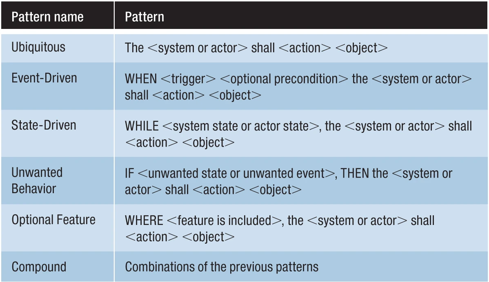

# Topic 4 Testing

- Requirements
- Test plans
- Usability testing
- Accessibiltiy

## Week 13 User stories: what should they be able to do?

### Learning objectives

- Explain why requirements are necessary and who the stakeholders are
- Name several methods that people use to write requirements
- Use the 'Easy Approach to Requirements Syntax' (EARS) to write requirements

### Reading

- &check; [PDF](../08-PDF/The%20Unplanned%20Journey%20of%20a%20Requirements%20Engineer%20in%20Industry%20-%20An%20Introduction.pdf) Gregory, S.'[The Unplanned Journey of a Requirements Engineer in Industry: An Introduction](https://ieeexplore.ieee.org/document/8048630)', IEEE Software 34(5) 2017, pp.16-19.

- &check; [PDF](../08-PDF/Easy%20Approach%20to%20Requirements%20Syntax%20(EARS).pdf) Mavin, A., P. Wilkinson, A. Harwood and M. Novak '[Easy Approach to Requirements Syntax (EARS)](https://ieeexplore.ieee.org/document/5328509)', 2009 17th IEEE International Requirements Engineering Conference (Atlanta, GA: IEEE, 2009), pp.317-322.

- &check; [PDF](../08-PDF/An%20Ancient%20(but%20Still%20Valid)%20Look%20at%20the%20Classification%20of%20Testing.pdf) R. L. Glass '[An ancient (but still valid?) look at the classification of testing](https://ieeexplore.ieee.org/document/4670725)', IEEE Software 2(6) Nov-Dec 2008, pp.112-112.

- &check; [PDF](../08-PDF/A%20Classification%20System%20for%20Testing%2C%20Part%202.pdf) R. L. Glass '[A classification system for testing, part 2](https://ieeexplore.ieee.org/document/4721193)', IEEE Software 26(1) Jan-Feb 2009, pp.104-104.

- &check; [PDF](../08-PDF/Validating%20and%20improving%20test-case%20effectiveness.pdf) Chernak, Y. '[Validating and improving test-case effectiveness](https://ieeexplore.ieee.org/document/903172)', IEEE Software 18(1) Jan-Feb 2001, pp.81-86.

### Intro to Requirements

> How to ensure that a system does what it is supposed to do?

1. Describe what is is supposed to do (requirements)
2. Check if it meets the requirements (testing)

> Who are requirements for?

1. End-users
2. Producing party
3. Perchasing party
4. Developers

> What kind of requirements do they understand?

### Requirements techniques 

**Natural Language**

**[Constrained natural language] Simplified technical English**:

- Short sentences
- Short paragraphs
- Limit grammar
- Active voice

**[Graphical] UML (Unified Modeling Langauge)**: Generate a UML diagram from classes

**[Formal] [Z Language](https://en.wikipedia.org/wiki/Z_notation)**: a formal specification language used for describing and modelling computing systems. 

### EARS

 Easy Approach to Requirements Syntax

---

## Week 14 Black box and white box testing

### Learning objectives

- Write out step by step and matrix style test procedures
- Differentiate between black box and glass/white box testing and provide examples of each
- Explain how automated blackbox testing can be achieved in video games

### Definition

#### Black box

1. system or component whose **inputs**, **outputs**, and **general function** are known but whose contents or implementation are unknown or irrelevant.

2. pertaining to an approach that treats a system or component as in (1).

#### Glass or white box -- unit testing

1. system or component whose **internal contents** or **implementation** are known.

2. pertaining to an approach that treats a system or component as in (1).

> Requirements can be written for both or one. 

#### Testing

Activity in which a system or component is executed under specified conditions, the results are observed or recorded, and an evaluation is made of some aspect of the system or component. 

**test case specification:** document specifying inputs, predicted results, and a set of execution conditions for a test item.

**test procedure specification:** document specifying a sequence of actions for the execution of a test.

> There is an ISO standard for software testing documentation.

### Test procedure template

- [ISO Test procedure template matrix](ISO%20test%20procedure%20template%20matrix.xlsx)

- [ISO Test procedure template step by step](ISO%20test%20procedure%20template%20step%20by%20step.xlsx)

### Automated black box testing

> Replying exclusively on playtesting conducted by humans can be costly and inefficient. Artificial agents could perform much faster play sessions, allowing the exploration of much more of the game space in much shorter time.
> 
> Zhao et al. "Winning isn't everything: Training agents to playtest modern games."

This is the paper describing the Sims Mobile agent: 

- [PDF](../08-PDF/Winning%20isn%E2%80%99t%20everything%20-%20Training%20agents%20to%20playtest%20modern%20games.pdf) Zhao, Y., I. Borovikov, A. Beirami, J. Harder, J. Kolen, J. Pestrak, J. Pinto, R. Pourabolghasem, H. Chaput, M. Sardari et al. '[Winning isn’t everything: Training agents to playtest modern games](https://web.archive.org/web/20201130170550/https://arxiv.org/pdf/1903.10545.pdf)', AAAI Workshop on Reinforcement Learning in Games 2019. 

This is a very detailed paper describing the state of the art in automated video game testing of video games. Read this if you want to see how one might go about analysing a research field, and also to find out what is possible in the area of automated testing. 

- [PDF](../08-PDF/Video%20Game%20Automated%20Testing%20Approaches%20-%20An%20Assessment%20Framework.pdf) Albaghajati, A.M. and M.A.K. Ahmed '[Video game automated testing approaches: an assessment framework](https://ieeexplore.ieee.org/abstract/document/9234724)', IEEE Transactions on Games.

---

## Week 15 Usability testing

### Learning objectives

-
-
-

---

## Week 16 Accessibility testing

### Learning objectives

-
-
-

---