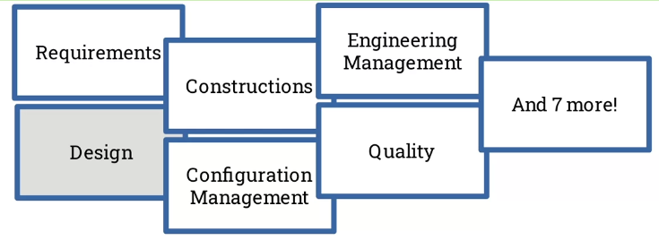

# Topic 1 Module Coupling, Cohesion and Complexity

## Week 1 Modules and module complexity

> Concept of module, and how we think about module complexity

### Learning Objectives

- Define the terms module and module complexity in terms of computer programs and systems

- Identify the modules present in computer programs and systems

- Analyse program code in terms of its complexity

### References

- **[SWEBOK](https://ieeexplore.ieee.org/document/6816804)**: Software Engineering Body of Knowledge

  Everything we know about building, maintaining, testing, quality evaluating... software.

  

- **[ISO/IEC/IEEE 24765](https://ieeexplore.ieee.org/document/5733835)**: a big vocabulary/dictionary of important terms in software engineering

### What is a module?

> #### Why write modular software?
>
> ...a mechanism for improving the flexibility and comprehensibility*of a system while allowing the shortening of its development time
>
> Parnas, 1972

- **Flexibility**: change it more easily, more reusable.

- **Comprehensibility**: understand code by chunks.

- **Shorter life cycle**: i.e. having different people in the team working on different parts.

A module is a...

- program unit that is discrete and identifiable with respect to compiling, combining with other units, and loading

    - **Compiling**: from source code to machine readable code, a module can be compiled on its own.

    - **Combining**: a module can be combined.

    - **Loading**: a module can be loaded independently.

- logically separable part of a program

    - are the code discrete?

    - is it clear which piece of code is doing what?

    - is your function containing too many logically separable part?

- set of source code files under version control that can be manipulated as one

    - source code management

    - is there a lot of files that can be imported into another repository?

- collection of both data and the routines that act on it

    - sounds like a class

> Some definitions challenge one another, we can choose the most appropriate one depending on the context.

### What is module complexity?

#### What is complexity?

1. Difficult to understand

2. Multiple components, multiple interactions

3. Difficult to verify

4. Metrics to measure the above

#### What's an example metric?

- Example metric: Sangwan et al.'s [**excessive structural complexity**](https://ieeexplore.ieee.org/document/4548410)
([Link to PDF](../PDF/Structural%20Epochs%20in%20the%20Complexity%20of%20Software%20over%20Time.pdf))

    Look at open-source software engineering projects, how to know the complexity of the program over time. Both absolute complexity and relative, the former will be the graph below, and the latter will be, when the code is broken apart into modules, the fat (how much is going on) decreases, but the tangle (interaction between modules) increases. 

    What they expect:

    

- module cohesion - what's in a module -- fat
- module coupling - interaction between modules -- tangle

#### Readings

- The classic [McCabe paper](https://ieeexplore.ieee.org/document/1702388) on module complexity
([Link to PDF](../PDF/A%20Complexity%20Measure.pdf))

- Bouwers et al.'s [Criteria for the evaluation of implemented architechtures](https://ieeexplore.ieee.org/document/5306330)
([Link to PDF](../PDF/Criteria%20for%20the%20evaluation%20of%20implemented%20architectures.pdf))

- Koziolek, Heiko's [Sustainability evaluation of software architectures: a systematic review](https://dl.acm.org/doi/abs/10.1145/2000259.2000263)
([Link to PDF](../PDF/Sustainability%20evaluation%20of%20software%20architectures%20-%20a%20systematic%20review.pdf))

---

## Week 2 Module cohesion: theory and analysis

> Which things we put into a module, and which things go into another module (i.e. function)

---

## Week 3 Module coupling: thoery and analysis

> Different ways modules interacting with each other, when those interactions are desirable and when they're not

---

## Week 4 Module coupling and cohesion in practice

> Common programing concepts and language techniques, connecting with the previous three weeks, with hands-on practices

---