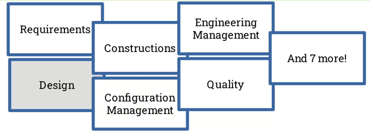
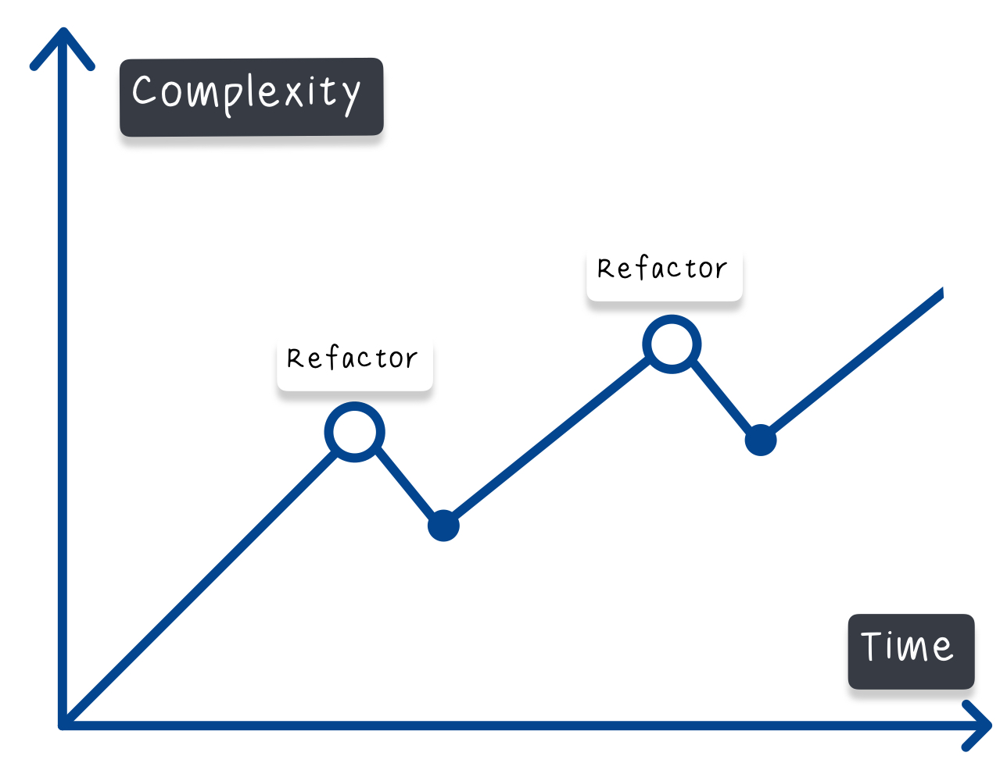
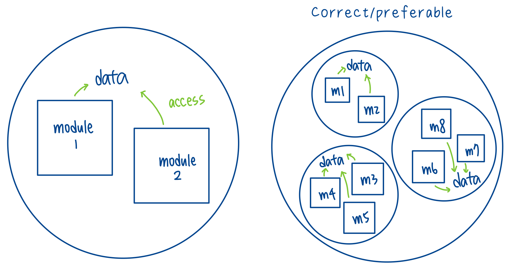
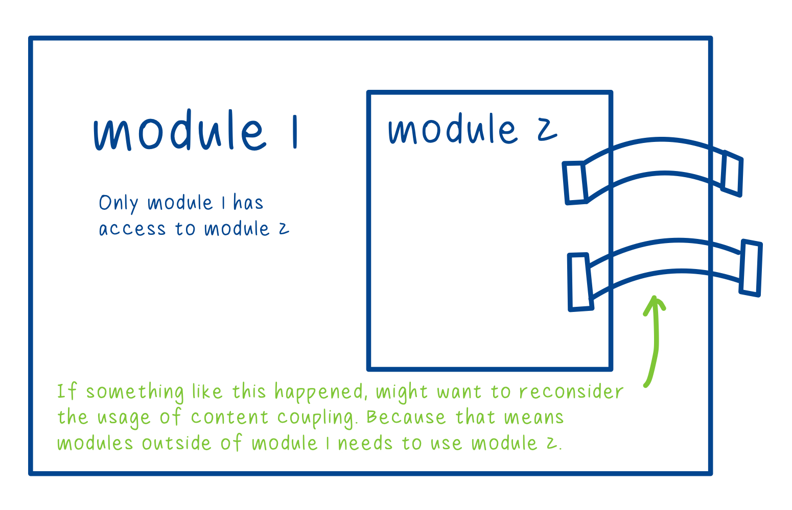
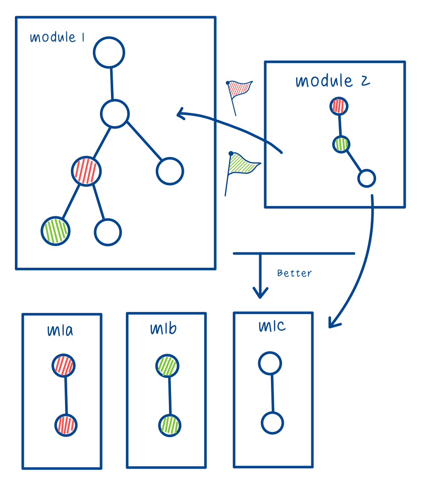
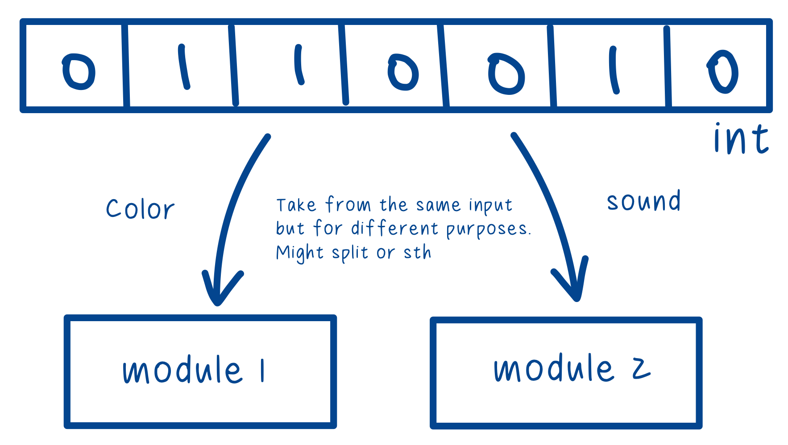

# Topic 1 Module Coupling, Cohesion and Complexity

## Week 1 Modules and module complexity

> Concept of module, and how we think about module complexity

### Learning Objectives

- Define the terms module and module complexity in terms of computer programs and systems

- Identify the modules present in computer programs and systems

- Analyse program code in terms of its complexity

### References

- **[SWEBOK](https://ieeexplore.ieee.org/document/6816804)**: Software Engineering Body of Knowledge

  Everything we know about building, maintaining, testing, quality evaluating... software.

  

- **[ISO/IEC/IEEE 24765](https://ieeexplore.ieee.org/document/5733835)**: a big vocabulary/dictionary of important terms in software engineering

### What is a module?

Why write modular software?

> ...a mechanism for improving the flexibility and comprehensibility of a system while allowing the shortening of its development time
>
> Parnas, 1972

- **Flexibility**: change it more easily, more reusable.

- **Comprehensibility**: understand code by chunks.

- **Shorter life cycle**: i.e. having different people in the team working on different parts.

A module is a...

- program unit that is discrete and identifiable with respect to compiling, combining with other units, and loading

  - **Compiling**: from source code to machine readable code, a module can be compiled on its own.

  - **Combining**: a module can be combined.

  - **Loading**: a module can be loaded independently.

- logically separable part of a program

  - are the code discrete?

  - is it clear which piece of code is doing what?

  - is your function containing too many logically separable part?

- set of source code files under version control that can be manipulated as one

  - source code management

  - is there a lot of files that can be imported into another repository?

- collection of both data and the routines that act on it

  - sounds like a class


> Some definitions challenge one another, we can choose the most appropriate one depending on the context.

### What is module complexity?

#### What is complexity?

1. Difficult to understand

2. Multiple components, multiple interactions

3. Difficult to verify

4. Metrics to measure the above

What's an example metric?

- Example metric: Sangwan et al.'s **[excessive structural complexity](https://ieeexplore.ieee.org/document/4548410)** ([Link to PDF](../PDF/Structural%20Epochs%20in%20the%20Complexity%20of%20Software%20over%20Time.pdf))

  Look at open-source software engineering projects, how to know the complexity of the program over time. Both absolute complexity and relative, the former will be the graph below, and the latter will be, when the code is broken apart into modules, the fat (how much is going on) decreases, but the tangle (interaction between modules) increases.

  What they expect:

  

  </detail>

- module cohesion - what's in a module -- fat
- module coupling - interaction between modules -- tangle

### Readings

- The classic [McCabe paper](https://ieeexplore.ieee.org/document/1702388) on module complexity
  ([Link to PDF](../PDF/A%20Complexity%20Measure.pdf))

- Bouwers et al.'s [Criteria for the evaluation of implemented architechtures](https://ieeexplore.ieee.org/document/5306330)
  ([Link to PDF](../PDF/Criteria%20for%20the%20evaluation%20of%20implemented%20architectures.pdf))

- Koziolek, Heiko's [Sustainability evaluation of software architectures: a systematic review](https://dl.acm.org/doi/abs/10.1145/2000259.2000263)
  ([Link to PDF](../PDF/Sustainability%20evaluation%20of%20software%20architectures%20-%20a%20systematic%20review.pdf))

---

## Week 2 Module cohesion: theory and analysis

> Which things we put into a module, and which things go into another module (i.e. function)

### Learning Objectives

- Define module cohesion in terms of comptuer program architechture

- Define types of module cohesion and identify them in computer programs

- Use programming techniques to improve module cohesion

### Readings

- [ISO/IEC/IEEE International Standard - Systems and software engineering -- Vocabulary](../PDF/ISO%20IEC%20IEEE%20International%20Standard%20-%20Systems%20and%20software%20engineering%20--%20Vocabulary.pdf)

### What is module cohesion?

> Module cohesion is a way to reason about the contents of a module.

- What we put into a module?

- Have we made good decisions about what goes into a module?

According to the ISO/IEEE...

- The manner and degree to which the tasks performed by a single software module are related to one another.

  - A single module & the relationship between items within the module, whether they are related or not.

- In software design, a measure of the strength of association of the elements within a module.

  - The strength of the relationship, how we characterize it, what's the meaning of that relationship.

#### Different types of module cohesion

- **Communicational**: the tasks performed by a software module _use the same input data or contribute to producing the same output data_

  - OK, that's how object-oriented programming works

- **Functional**: the tasks performed by a software module _all contribute to the performance of a single function_

  - OK, they all are working towards a certain goal, but depends on how clear the goal is defined.

- **Logical**: the tasks performed by a software module _perform logically similar functions_

  - OK/Bad, processing things in similar ways but very different context (communicational cohesion not met)

- **Procedural**: the tasks performed by a software module _all contribute to a given program procedure, such as an iteration or decision process_

  - Bad-ish

- **Sequential**: _the output of one task_ performed by a software module _serves as input to another task_ performed by the module

  - Bad, slightly worse than procedural

- **Temporal**: the tasks performed by a software module are _all required at a particular phase of program execution_

  - Bad

- **Coincidental**: the tasks performed by a software _have no functional relationship to one another_

  - Bad, pure hell

---

## Week 3 Module coupling: thoery and analysis

> Different ways modules interacting with each other, when those interactions are desirable and when they're not

### Learning Objectives

- Give a high level definition of module coupling and illustrate with an example

- Analyse computer programs to identify different types of module coupling

- Describe different types of module coupling and discuss which are desirable and which are not

### What is module coupling?

1. manner and degree of interdependence between software modules

   - _interdependence_: two modules rely on each other to work
   - _manner of interdependence_: how does it rely on that module?
   - _degree of interdependence_: how many points of reliance are there?

2. strength of the relationships between modules

   - how much impact do they have on each other?

3. measure of how closely connected two routines or modules are

   - indirect impacts, or both closedly related to a module but no direct contacts

4. in software design, a measure of the interdependence among modules in a computer program

### Different types of module coupling

- **Common environment**: two modules access a common data area

  - It's okay, but data **could** end up in unpredictable states.

    

- **Content**: some or all contents of one module are included in the content of another module

  - Acceptable. This is a very common way of designing and writing code.

    

- **Control**: one module communicates information to another module for the explicit purpose of influencing the latter module's execution

  - Bad, might have some edge cases that's acceptable.
    

- **Data/Input-Output**: output from one module serves as input to another module

  - Good, standard.

- **Hyrbid**: different subsets of the range of values that a data item can assume are used for different and unrelated purposes in different modules

  - Bad.
    

- **Pathological**: one module affects or depends upon the internal implementation of another
  - Very Bad. Like hybrid but worse.

---

## Week 4 Module coupling and cohesion in practice

> Common programing concepts and language techniques, connecting with the previous three weeks, with hands-on practices

### Learning Objectives

- Explain the connection between common programming concepts and module concepts

- Using programming techniques to improve module coupling and cohesion

- Use language features to improve module coupling and cohesion

### Reading

- [W3School's JavaScript scope](https://www.w3schools.com/js/js_scope.asp)

  - Block, function, global scope

- [W3School's JavaScript const](https://www.w3schools.com/JS/js_const.asp)

### Scope

```
var x, y, z;

function addition(){
  z = x + y;
}

console.log(z); // Undefined
addition();
console.log(z); // NaN
```

Adding parameters to the function

```
var x, y, z;

function addition(p1, p2){
  return p1 + p2;
}

x = 10;
y = 12;
z = 14;

console.log(z); // 14
z = addition(x, y);
console.log(z); // 22
```

### Function parameters

Bad example (no need for allowing the module to have access to the whole game's state)

```

var game_state = {
  "lives": 3,
  "score": 125,
  "level": 4
}

function canHaveExtraLife(current_game_state){
  if (current_game_state.lives < 2 &&
      current_game_state.level > 4){
    return true;
  } else {
    return false;
  }
}


```

Instead:

```

var game_state = {
  "lives": 3,
  "score": 125,
  "level": 4
}

function canHaveExtraLife(lives, level){
  if (lives < 2 && level > 4){
    return true;
  } else {
    return false;
  }
}


```

### Const

Example of pathological coupling.

```
function addition(p1, p2){
  return p1+p2;
}

function pathos(){
  addition = function(p1, p2){
    return p1*p2;
  }
}

var z;
z = addition(10, 12); // 22
pathos();
z = addition(10, 12); // 120

```

Adding the const to `addition()` to rule it

```
const function addition(p1, p2){
  return p1+p2;
}

function pathos(){
  addition = function(p1, p2){
    return p1*p2;
  }
}

var z;
z = addition(10, 12); // 22
pathos(); // will cause error
z = addition(10, 12);

```

---
