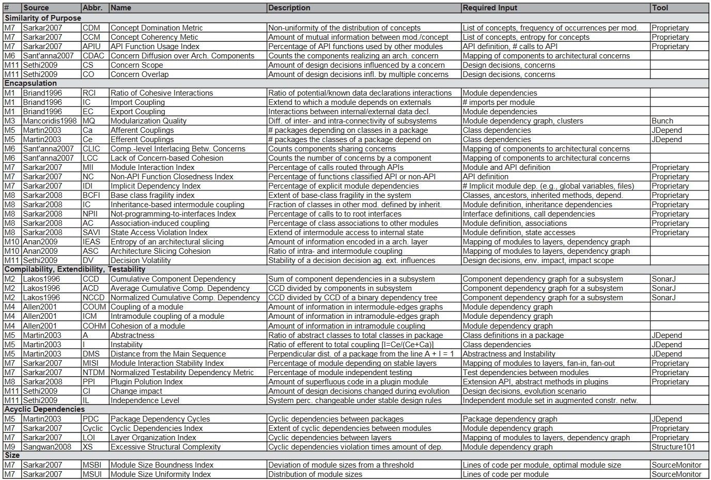

# Practice Quiz

## 1.0205 Post-video quiz

> 1.0204 What is a module?

1. According to Parnas (1972), what are the three main reasons to promote modularity of code?

   - [ ] Cleaner code
   - [x] Shortening of development time
   - [ ] Easier to manage in version control
   - [ ] Portability
   - [ ] Reduced source code needed
   - [ ] Style
   - [x] Flexibiltiy
   - [x] Comprehensibility

2. What is a module?

   - A module can be an independent piece of software that can be run by itself and can be compiled, but it could also be a combination of modules. It can also mean a system in source code management, where you determine how to separate files and organize them.

## 1.0207 Post-video quiz

> 1.0206 What is module complexity?

1. Is it possible to measure complexity objectively?

   - [x] Yes
   - [ ] No

2. Koziolek (see reading list) found approximately 40 potentially useful measures for software complexity. Which of the below are in that list?

   - [x] Afferent couplings
   - [x] Entropy of an architectural slicing
   - [ ] Fatness
   - [x] Abstractness
   - [ ] Impact factor
   - [ ] Strongly-coupled boundness cohesion

## 1.021 Post video quiz

> 1.0209 Complexity case study

1. Using the terms used by Sangwan and McCabe, a program with a small number of large modules and few connections between them could be said to have:

   - [ ] Low fat, high tangle.
   - [ ] Low fat, low tangle.
   - [x] High fat, low tangle.
   - [ ] High fat, high tangle.

2. You've now seen videos where Matt has explained some ideas about complexity and seen him go through a program you know from earlier in the course with these ideas. Has this made you think about how you design and write your own programs? If so, how?

   - Yes, since I'm looking at a different case study than the one I've chosen, I have a more fresh and clear eye to look at the project's source code, it is clear to me that the naming is done quite well. Also, the organization of files, and the functions within each file are really neat and tidy, easy to find and reference.

## 1.0212 Write a definition of module complexity

1. Write a short paragraph that defines module complexity.

   - Module complexity is defined by the module's readability, compactness, and file structures. If a program has very few modules each very large, the complexity is high because the code is probably hard to read and understand. A program with a messy file structure can cause a hard time locating modules, hard to verify.

## 2.0202 Post-video quiz

1. The manner and degree to which tasks performed by a single software module are related to one another. What is this a definition for?

   - [ ] Software cohesion
   - [ ] Module coupling
   - [x] Module cohesion
   - [ ] Module complexity

2. Which types of cohesion are always acceptable?

   - [x] Communicational
   - [ ] Procedural
       <detail>
   
Incorrect

   No. While it may seem like this is an acceptable type of cohesion, data often changes during use – meaning that you could be working on several different versions/sets of data within a procedurally cohesive module. Instead, these procedures should be split up into smaller parts, determined by the individual steps in the procedure.
   </detail>
   - [x] Functional
   - [ ] Coincidental
   - [ ] Logical
       <detail>
   
Incorrect

   No. This is **sometimes** okay, but not always. Just because the elements may look like they're doing similar things, its doesn't mean that they actually are doing similar things.
   </detail>
   - [ ] Temporal
       <detail>
   
Incorrect

   No. Just because processes happen close to each other in time, doesn't mean they belong together in code.
   </detail>

## 2.0205 Post-video quiz

> 2.0204 Why are different types of module cohesion good or bad?

1. What are the disadvantages of not designing your modules properly?

   - Not designing modules properly will increase the module complexity. Difficult to understand, verify, and therefore hard to reuse and modify. Also, it might cause more runtime and space in order to run it.

## 2.0207 Post-video quiz

> 2.0206 Module cohesion case study

1. What do you think about the module cohesion so far in your programming practice? Would you change the way you do things as a result of these videos on cohesion?

   - These videos certainly let me reconsider my past choices of making what functions into a module/file, questioning what are my reasonings to do so, and will definitely be thinking about the ok cohesions (communications, functional, logical) when writing functions into a module in the future.

## 2.0208 Define module cohesion

1. Write a short definition of module cohesion.

   - Module cohesion is about the what, why, and how items exist within a module.

## 3.0202 Post-video quiz

> 3.0201 What is module coupling?

1. Which of the following are accepted definitions for a module?

   - [ ] Sequential

   - [ ] Hot-pluggable

   - [x] Logically separable part of a program

   - [ ] Ratio of fat and tangle

   - [x] Compilable unit

2. Module coupling is:

   - [ ] Where modules are joined together permanently.

   - [x] How closely connected (near or far) two modules are

   - [x] The strength of relationships between modules

   - [x] The manner and degree of interdependence of two modules

   - [ ] Reduction of the tangle between two modules.

## 3.0206 Post-video quiz

> 3.0205 Common environment coupling: good or bad?

1. How good does Matt think common environment coupling is?

   - [ ] Fantastic
   - [x] It's okay, but data **could** end up in unpredictable states.
   - [ ] Bad. Just bad.

## 3.0208 Post-video quiz

> 3.0207 Content coupling: good or bad?

1. How good does Matt think content coupling is?

   - [ ] Aweful
   - [x] Acceptable. This is a very common way of designing and writing code.
   - [ ] Not recommended.

## 3.0210 Post-video quiz

> 3.0209 Control coupling: good or bad?

1. How good does Matt think control coupling is?

   - [x] Bad. Just bad.
   - [ ] Good
   - [ ] Has its uses.

   > Correct - he did say that. But remember is is a continuum. There might be some edge cases where it is acceptable. For example, a sorting function that takes a comparison function as an argument.

## 3.0212 Post-video quiz

> 3.0211 Data coupling: good or bad?

1. How good does Matt think data coupling is?

   - [ ] It has its uses.
   - [x] Good.
   - [ ] Bad. Just bad.

## 3.0214 Post-video quiz

> 3.0213 Hybrid coupling: good or bad?

1. How good does Matt think hybrid coupling is?

   - [x] Bad.
   - [ ] Good. This is good and common practice.
   - [ ] It's okay - it is often useful.

   > Correct. It's messy data use, and generally a bad idea – unless you have an extreme limitation of hardware to overcome (e.g. very limited memory like on a ZX Spectrum – an early 1980s home computer in the UK).

## 3.0216 Post-video quiz

> 3.0215 Pathological coupling: good or bad?

1. How good does Matt think pathological coupling is?

   - [x] Bad.
   - [ ] Recommended.
   - [ ] It has its uses.

   > Correct. One module should not go and change the function of another module directly. Only very small use case (e.g. live sound performance using coding).

## 3.0218 Define module coupling

1. Write a short definition of module coupling.

   - Module coupling is the relationship between modules, the strength of the relationship, and the measure of the strength of the relationship.

## 4.0202 Post-video quiz

> 4.0201 Reasoning about scope

1. What did Matt do to improve the coupling and cohesion of the example program?

   - [ ] Passed in numbers rather than variables.

   - [ ] He defined x, y and z as ints, rather than leaving them as vars.

   - [x] Rewrote addition() to receive parameters, rather than add together global variables.

   > Correct. By rewriting this function to accept two parameters to add together, rather than two global variables that exist outside of it, this function has become decoupled from the rest of the program, less dependent on what goes on outside of it, and could be easily copied and pasted into another program and keep its functionality.

## 4.0204 Post-video quiz

> 4.0203 Reasoning about function parameters

1. What did using 'lives' and 'level', instead of the entire game_state, as function parameters achieve in this example?

   - [ ] Reduce the functionality of canHaveExtraLife().

   - [x] Decoupling of code meant that reference to data structure was removed, making the function reusable, more flexible and less likely to cause bugs.

   - [ ] It allows finer control of variables.

   > Yes. canHaveExtraLife() can now be used wherever it's useful since it doesn't need to know about the game state at all. It also means that if canHaveExtraLife() doesn't 'know' about the game_state, it can't accidentally change it without us realising – which means you're less likely to end up with bugs because of that.

## 4.0206 Post-video quiz

> 4.0205 Replacing functions dynamically and const

1. Thinking back to your lectures on coupling, is pathological coupling generally a good way to couple together modules?

   - [x] No

   - [ ] Sometimes

   - [ ] Yes

## 4.0209 Programming techniques and language features

1. Explain briefly the difference between programming techniques and language features. You might not think that they are completely separable. That's fine - if so, explain why.

   - Programming techniques are more about the general ways to work around programs, whereas language features focus more on the specific language, what it can do.

   > Here is my attempt: Programming techniques relate to the way you structure and organise the code and the choices you make about control flow and data. Language features are related and interact with programming techniques but they can be used to more strongly control how programmers work with your modules.
